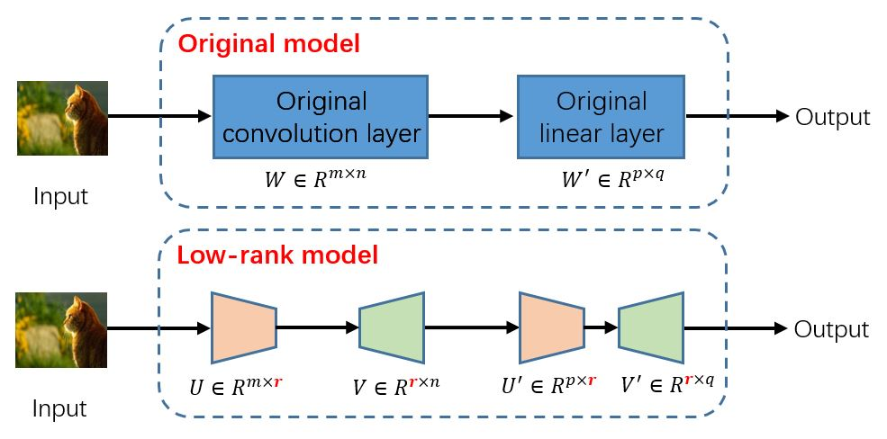

# Low-rank Model Training From Scratch
This repository contains low-rank version implementations 
of common models like Multi-layer perceptron (MLP), Long Short Term Memory (LSTM), 
Visual Geometry Group (VGG), Residual Network (ResNet), Transformer and 
Vision Transformer (ViT).
The aim of this repository is to help those people who are interested in low-rank 
model updates.

## What is the low-rank model?
The term "low-rank model" is related to its original model (which is the undecomposed model). 
For example, for a Convolutional Neural Network (CNN) model (the original model), its 
corresponding low-rank model can be obtained by decomposing the convolution layer and 
the linear layer in the original model, as shown in the figure below.

## Why do we want to train the low-rank model?
Generally, the size of the low-rank model is smaller than the original model, which means
that training the low-rank model requires much less computation and memory overhead than 
training the original full model. We can control the cost of training the low-rank model 
by adjusting the low-rank decomposition ratio.  A natural thought is that if we can train 
a low-rank model from scratch such that it performs as well as training the original model 
from scratch, then we can reduce the total computing overhead required for model training 
and inferencing.

## Is low-rank model training effective?
Previous works [1-5] have shown that training a low-rank model from scratch can achieve
the same performance as training the original full model from scratch. [6] analyzes the 
convergence relation between the low-rank model and the original model, and proves that 
the original model can be converged by training it in the corresponding low-rank weight 
subspace under non-convex settings. It is interesting to note that there are some popular 
low-rank fine-tuning techniques [7-8] whose goal is to update a pre-trained large model (
original full model), rather than updating a low-rank model and training it from scratch. 
Therefore, there are fundamental differences between the two technologies.

[1] Low-rank matrix factorization
for deep neural network training with high-dimensional
output targets (ICASSP 2013)  
[2] Convolutional neural
networks with low-rank regularization (ICLR 2016)  
[3] Initialization and regularization of factorized neural layers (ICLR 2021)  
[4] Pufferfish:
Communication-efficient models at no extra cost (MLSys 2021)  
[5] Cuttlefish: Low-rank model training without all the tuning (MLSys 2023)  
[6] FedLMT: Tackling System Heterogeneity of Federated Learning via 
Low-Rank Model Training with Theoretical Guarantees (ICML 2024)  
[7] Lora: Low-rank adaptation of large language models. (ICLR 2022)  
[8] Relora: High-rank training through low-rank updates (WANT @ NeurIPS 2023)

## How to use this repository?
**Experimental Setup.**
First, you should install the necessary libraries using the following command: 
`pip install requirements.txt`. Then, you can see the file `script.sh` to learn 
how to run the original model or the low-rank model.

**Models and Datasets**. Currently, this repository supports MLP, CNN, LSTM, VGG, ResNet, 
Transformer and Vision Transformer. You can add your custom model conveniently 
in the `model` folder. The corresponding datasets include CIFAR10/CIFAR100, Shakespeare and 
WikiText2.

**Other Tricks**. This repository implements ***hybrid model architecture*** and ***regularization***
techniques to improve the final performance of low-rank models. The details of these techniques
can be found in [3, 4, 6].

**Notes**. The implementation of low-rank LSTM or low-rank RNN-based model is based on `TorchScript`, 
which allows people to implement their own custom RNNs with CUDA optimization 
([link](https://pytorch.org/blog/optimizing-cuda-rnn-with-torchscript/)). However, I find that
it is still very slow compared to the built-in LSTM api in Pytorch. At the moment, I do not know how 
to write efficient low-rank LSTM implementation code. How to imporve it will be considered in the 
future work.

## Testing results (Example)
The following table show the performance of the original full model and that of the low-rank model (the low
-rank ratio is 0.2, and no using hybrid model architecture) with 
or without regularization technique (default: Frobenius decay). Here we use `fvcore`, a library produced by FaceBook
to estimate the size of the model and the computation cost needed for the model forward. Note that the result 
of the low-rank LSTM is incomplete since `fvcore` can not support `TorchScript`.

From the results we can find that 
* Low-rank model training is effective, and it can achieve the accuracy close to that of full model training while 
 reducing the training cost.
* Regularization is effective, too. It can enhance the performance of the low-rank model.

Actually, we can further enhance the model performance by using hybrid model architecture technique, where the 
corresponding results can be found in the previous literatures.

| Dataset     | Model       | Metric              | Original Model | Low-rank Model | Low-rank Model with regularization |
|-------------|-------------|---------------------|----------------|----------------|------------------------------------|
| Wikitext2   | Transformer | Perplexity          | 3.36           | 3.45           | 3.37                               |
|             |             | Size(MB) / FLOPs(M) | 10.36 / 390    | 8.98 / 302     | 8.98 / 302                         |
| CIFAR10     | ViT         | Accuracy(%)         | 84.64          | 73.60          | 73.23                              |
|             |             | Size(MB) / FLOPs(M) | 9.52 / 643     | 3.22 / 233     | 3.22 / 233                         |
| CIFAR10     | VGG11       | Accuracy(%)         | 91.40          | 85.68          | 87.66                              |
|             |             | Size(MB) / FLOPs(M) | 9.76 / 154     | 4.01 / 55.96   | 4.01 / 55.96                       |
| CIFAR10     | VGG16       | Accuracy(%)         | 92.96          | 90.39          | 91.83                              |
|             |             | Size(MB) / FLOPs(M) | 15.25 / 315    | 6.21 / 120     | 6.21 / 120                         |
| CIFAR10     | ResNet18    | Accuracy(%)         | 93.39          | 90.14          | 91.67                              |
|             |             | Size(MB) / FLOPs(M) | 11.17 / 559    | 4.42 / 229     | 4.42 / 229                         |
| CIFAR10     | ResNet101   | Accuracy(%)         | 93.57          | 90.45          | 90.63                              |
|             |             | Size(MB) / FLOPs(M) | 41.35 / 2451   | 16.46 / 985    | 16.46 / 985                        |
| Shakespeare | LSTM        | Accuracy(%)         | 50.46          | 50.94          | None                               |
|             |             | Size(MB) / FLOPs(M) | 0.825 / 1.638M | None           | None                               |

